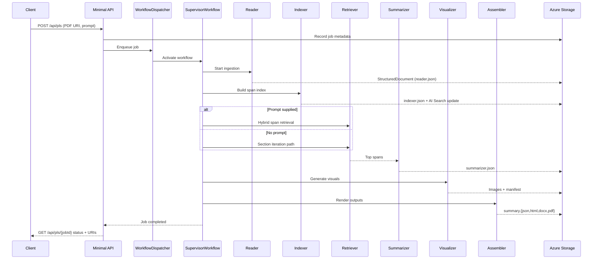

# LaySumm Technical Flow (PDF Example)

This document traces how a single uploaded PDF moves through the LaySumm Microsoft Agent Framework pipeline and emerges as a patient-friendly plain-language summary (PLS). It highlights the touchpoints between agents, storage services, and workflow checkpoints.

## 1. Example Scenario
- **User request:** `POST /api/pls` with the prompt “Explain safety outcomes in simple terms.”
- **Input artifact:** `safety-results-phase-III.pdf` (18 pages, clinical trial report) already uploaded to an Azure Blob Storage container `pls-input`.
- **Output contract:** Machine-readable JSON envelope plus rendered HTML, DOCX, and PDF summaries. Every sentence must cite a provenance span and include any generated figures.

## 2. High-Level Sequence
```
Client → Minimal API → Workflow Queue → Supervisor Workflow
        → ReaderAgent → IndexerAgent → (RetrieverAgent | SectionIterator)
        → SummarizerAgent → VisualizerAgent → AssemblerAgent
        → Azure Storage outputs → Status polling response
```
Checkpoints are taken after ingestion/indexing and before rendering so failed steps can be retried without restarting the entire job.

## 3. Step-by-Step Walkthrough

### 3.1 Job Intake & Dispatch
- Minimal API validates the request, writes a `JobCreated` record to Azure Table/SQL, and echoes the job ID.
- The PDF URI, user prompt, and configuration snapshot are enqueued to `WorkflowDispatcher`.
- A background worker picks up the queue item and instantiates the `SupervisorWorkflow` graph.

### 3.2 ReaderAgent (Ingest & Normalize)
- **Inputs:** Blob URI, SAS token, job metadata.
- **Actions:** Downloads the PDF, runs OCR (if necessary), maps layout (headings, paragraphs, tables, figures), extracts references, and tags each span with a provenance ID: `jobId/page/element`.
- **Outputs:** `StructuredDocument` JSON uploaded to Blob Storage (`pls-workdir/{jobId}/reader.json`) and persisted to the workflow thread state. Checkpoint `ReaderCompleted`.

### 3.3 IndexerAgent (Searchable Representation)
- **Inputs:** `StructuredDocument`.
- **Actions:** Splits content into section → paragraph → sentence nodes with ±2 sentence overlap, enriches with MeSH/drug entities, creates dense embeddings via Azure OpenAI, and writes keyword metadata.
- **Outputs:** Hybrid search index update (Azure AI Search index `pls-span-index`) and serialized span catalog stored alongside the job artifacts (`indexer.json`). Checkpoint `IndexerCompleted`.

### 3.4 RetrieverAgent or SectionIterator
- **Branch condition:** Because the user supplied a prompt, the workflow activates `RetrieverAgent`; otherwise `SectionIterator` would iterate sections in Table-of-Contents order.
- **RetrieverAgent Actions:** Issues a hybrid vector + keyword query, re-ranks with a cross-encoder, deduplicates overlapping spans, and returns the top 8 spans covering safety outcomes.
- **Outputs:** Span shortlist with provenance IDs, confidence scores, and suggested optional context windows.

### 3.5 SummarizerAgent (Plain-Language Draft)
- **Inputs:** Prompt, shortlisted spans, job style guardrails.
- **Actions:** Generates a section-level narrative at 8th–10th grade reading level, embeds inline citations `[Page 12, Para 3]`, calls glossary helpers for defined terms, and records “Why it matters” and “Limitations” blocks.
- **Outputs:** Summary payload (`summarizer.json`) placed in the workflow state. Provenance cross-check ensures every sentence references a span. Checkpoint `SummaryDrafted`.

### 3.6 VisualizerAgent (Figures & Alt Text)
- **Inputs:** Summarizer narrative, original figure references.
- **Actions:** Preserves original figures by referencing their provenance IDs and crafts DALL·E prompts such as “Simple chart comparing treatment vs placebo adverse events, percentages on Y axis, plain colors.” Calls the image model, stores generated assets in Blob Storage (`pls-workdir/{jobId}/images/{guid}.png`), and writes captions plus WCAG-compliant alt text.
- **Outputs:** Visual asset manifest appended to workflow state.

### 3.7 AssemblerAgent (Final Packaging)
- **Inputs:** Summarizer narrative, visual manifest, job metadata.
- **Actions:** Builds the JSON envelope (sections, citations, glossary, limitations, image references) and renders HTML, DOCX, and PDF using OpenXML/templating. Generates a traceability matrix mapping each sentence to provenance IDs.
- **Outputs:** Uploaded artefacts:
  - `pls-output/{jobId}/summary.json`
  - `pls-output/{jobId}/summary.html`
  - `pls-output/{jobId}/summary.docx`
  - `pls-output/{jobId}/summary.pdf`
- Writes `JobCompleted` record with download URIs. Checkpoint `RenderCompleted`.

### 3.8 Status Polling
- The client polls `GET /api/pls/{jobId}`.
- API consults the job table; if complete, returns the artifact URIs and quality-check reports (readability scores, citation completeness).

## 4. Data & Provenance Considerations
- **Blob Storage:** `pls-input` (raw uploads), `pls-workdir` (intermediate artifacts), `pls-output` (final assets).
- **Search Index:** Each span document contains embeddings, keywords, layout coordinates, and provenance path for reproducibility.
- **Telemetry:** Agent invocations are wrapped with middleware that logs latency, model usage, and retry counts without leaking PHI.
- **Failure handling:** On transient failures, the workflow resumes from the last checkpoint. Catastrophic failures mark the job as `Failed` with diagnostic details.

## 5. Result Snapshot (Example)
- **Summary excerpt:** “Most treatment-related side effects were mild stomach issues and occurred at similar rates in both groups [Page 12, Para 3].”
- **Generated visual:** Bar chart comparing adverse-event percentages with alt text “Bar chart showing similar rates of mild side effects (22% vs 20%) for treatment and placebo groups.”
- **Glossary entries:** “Adverse event,” “Placebo,” “Phase III trial.”
- **Limitations:** Notes small sample size and short follow-up period.

## 6. Sequence Diagram


This flow document can be used to onboard engineers, verify end-to-end readiness, and reason about monitoring or extensibility gaps across the LaySumm agentic architecture.
